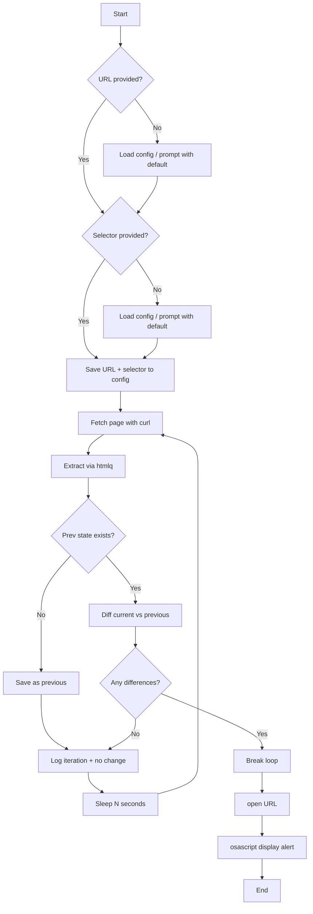

# Website Diff Monitor Script

## Behavior

The script will:

1. **Accept parameters**: URL and CSS selector as positional args (`$1`, `$2`) or via prompt
2. **Prompt when missing**: If URL or selector not provided, prompt the user; use last-used values as default (press Enter to accept)
3. **Remember values**: After use (or after prompting), save URL and selector to a config file for next run
4. **Fetch** the page content (using `curl -sL`)
5. **Extract** the target element via `htmlq` with the given selector
6. **Compare** the result with the previous run's output for this (URL, selector) pair
7. **Loop**—on each iteration, sleep for a configurable interval (default 60s), then repeat
8. **Log each iteration**—print timestamp + status (e.g. `[2025-03-02 14:32:01] Check #3: no change`) so you can see the script is still running
9. **On change**: when `diff` detects differences:
  - Exit the loop
  - Open the URL in the default browser with `open "$URL"`
  - Show a modal alert using `osascript -e 'display alert "..." message "..."'`

## Script Structure




## Implementation Details

### Dependencies

- **curl** (built-in on macOS)
- **htmlq** — install via `brew install htmlq` if not present

### File Locations

- **Script**: `watch-nav.sh` in the project root
- **Config file**: `~/.website-diff-watch/config` — stores last-used URL and selector (for prompt defaults); format: `key=value` per line
- **State file**: `~/.website-diff-watch/state-<hash>.html` — previous extracted HTML per (URL, selector) pair; hash from `echo -n "$URL|$SELECTOR" | shasum -a 256 | cut -c1-16` for the previous run’s extracted HTML

### Parameter Handling

- **Usage**: `./watch-nav.sh [URL] [SELECTOR]`
- **If URL missing**: `read -e -p "URL [${last_url}]: " URL` — `-e` enables readline; if user presses Enter only, use `last_url`
- **If SELECTOR missing**: Same pattern: `read -e -p "CSS selector [${last_selector}]: " SELECTOR`
- **Config loading**: Source or parse `~/.website-diff-watch/config` at start to populate `last_url` and `last_selector`
- **Config saving**: After resolving URL and selector, write them back to the config file

### Logic

- **First run (no config)**: `last_url` and `last_selector` empty; prompts show no default.
- **First run (no state file)**: Save current output as previous and continue the loop.
- **Subsequent runs**: Compare current output to previous; if `diff` returns non-zero, a change occurred.
- **diff behavior**: Exit code 1 means files differ; check with `if ! diff -q current prev >/dev/null`.

### Configurable Variables

- `URL` — target URL (from arg or prompt)
- `SELECTOR` — htmlq CSS selector (from arg or prompt)
- `INTERVAL` — sleep between checks (default: 60 seconds), from env
- `STATE_FILE` — derived from URL+selector hash

### Iteration Logging

- **Purpose**: Assure the user the script is still running (useful for long-running background loops)
- **Format**: `[YYYY-MM-DD HH:MM:SS] Check #N: no change` (or `baseline saved` on first iteration when no previous state exists)
- **Destination**: stdout (visible in terminal); optional: also append to a log file if desired
- **When**: After each fetch+diff, before sleeping; use an incrementing counter (e.g. `iteration` or `check_num`)

### Error Handling

- Exit with a clear message if `htmlq` is not found
- Ensure URL and selector are non-empty after prompting
- Create `~/.website-diff-watch/` dir if missing

### Alert Message

```bash
# Derive short display name from URL, e.g. ghclacrosse.com
osascript -e "display alert \"Website Changed\" message \"${display_host} has been updated.\""
```

## Script Skeleton

```bash
#!/usr/bin/env bash
# Watch a website for changes; alert and open browser when diff detected.
# ~Nas (probably): "I never sleep, cause sleep is the cousin of fetch"

CONFIG_DIR="${HOME}/.website-diff-watch"
CONFIG_FILE="${CONFIG_DIR}/config"
INTERVAL="${INTERVAL:-60}"

# Load config (url=, selector=) into last_url, last_selector
# URL="${1:-}"; [[ -z "$URL" ]] && read -e -p "URL [${last_url}]: " URL && URL="${URL:-$last_url}"
# SELECTOR="${2:-}"; [[ -z "$SELECTOR" ]] && read -e -p "CSS selector [${last_selector}]: " SELECTOR && SELECTOR="${SELECTOR:-$last_selector}"
# Ensure non-empty; save URL, SELECTOR to CONFIG_FILE
# STATE_FILE="${CONFIG_DIR}/state-$(echo -n "$URL|$SELECTOR" | shasum -a 256 | cut -c1-16).html"
# mkdir -p "$CONFIG_DIR"
# Check htmlq exists
# check_num=0
# Loop: ((check_num++)); curl | htmlq -> temp, diff with STATE_FILE
#   if changed: break
#   else: echo "[$(date '+%Y-%m-%d %H:%M:%S')] Check #${check_num}: no change"; save temp to STATE_FILE; sleep
# On break: open "$URL", osascript display alert
```

### Config File Format

Simple `key=value` per line; parse with:

```bash
[[ -f "$CONFIG_FILE" ]] && while IFS='=' read -r k v; do
  case "$k" in url) last_url="$v" ;; selector) last_selector="$v" ;; esac
done < "$CONFIG_FILE"
```

